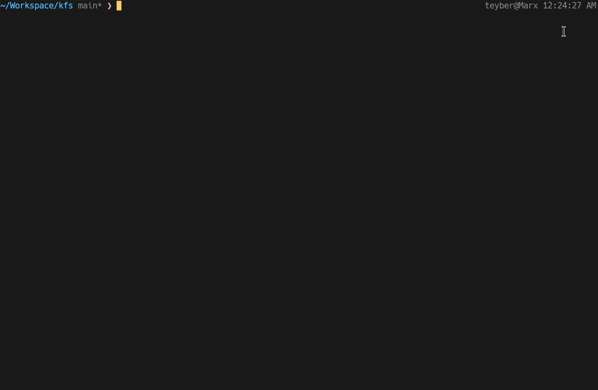

# Kernel From Scratch

This is a project for the 42 school where we have to build a whole kernel starting
from scratch. We have to use a x86 architecture and a bootloader to load the kernel
into the machine (or the emulator).

## Progress

- [x] Boot the kernel
- [x] Print some text to the screen
- [x] Manage colors
- [x] Load a GDT
- [x] Load an IDT and setup PICs
- [x] Manage keyboard (using interrupts)
- [x] Add a small shell with a few commands (clear, lsmmap, shutdown, reboot...)
- [x] Manage exceptions (using interrupts)
- [ ] Enable paging, and manage memory (physical and virtual addresses).
- [x] Setup Higher half kernel


## Dependencies
Tested only under Ubuntu, but it should work on any system that is using `apt`.

The setup script will install the following dependencies:
- build-essential (a basic compiler, make and everything needed to build a cross compiler)
- nasm
- all the dependencies for compiling gcc

But it will not install qemu, grub or xorriso. You have to install them yourself if you want to run the kernel.

## Usage
First, run the setup script:
```sh
./setup.sh
```

Then, you can make the kernel:

```sh
make
```

- Then, depending on your needs, you can run the kernel:

```sh
make run_curses #if you want to run the kernel in curses mode
make run_gtk #if you want to run the kernel in gtk mode (requires gtk3)
make run_debug #if you want to run the kernel in debug mode (then you have to use gdb, using the `debug` target)
make run_monitor #if you want a detached monitor (to another terminal, then you have to connect to it using the `monitor` target, or use the `telnet <ip> 1234` command)
 ```

## Example pictures



## Useful links
- The osdev wiki: [https://wiki.osdev.org/](Link)

It contains a lot of useful information about the x86 architecture and os development in
general.

- The little OS book: [https://littleosbook.github.io/#paging-in-x86](Link)
